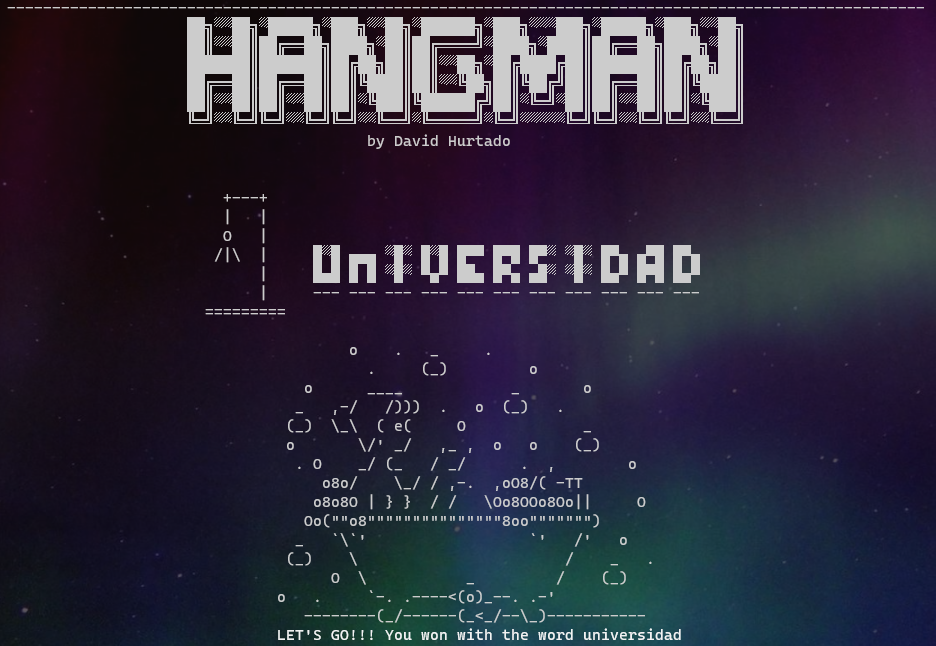

# Python Hangman

    

V 1.0

## Install the game

Download on your computer the [[installer]][installer] file, you can do it manually or do it from terminal with:

`curl https://github.com/kenny2408/hangman_game/blob/master/installer.sh`

Then give the execution permission to the file with:
`chmod +x installer.sh`

Then execute the file simply writing its name.
`installer.sh` or `./installer.sh`

And follow the instructions of the installer.

Then, if you in are in a unix operative system (Linux or macOS), please restart the terminal
if you are in Windows 10, create an alias like this:
`alias hangman=py C:\Users\PathToTheFile\hangman_game\main.py`

In both cases, restart the terminal and make an `hangman -c` to configurate the game.

[installer]: https://github.com/kenny2408/hangman_game/blob/master/installer.sh "installer"
